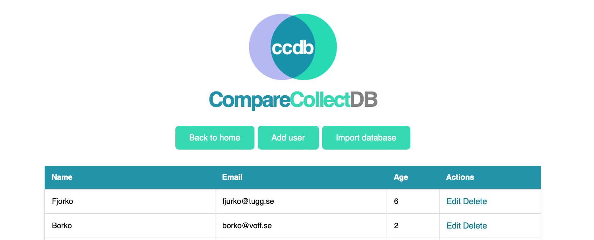

# ccdb
CompareCollectDB - Administrative web application for SQL queries and database management. Designed to easily compare and collect data from multiple sources.

---

This is a Flask web application that uses SQLAlchemy to interact with any SQLite database. The application currently supports CRUD (Create, Read, Update, Delete) operations on a User table, which consists of columns such as name, email, and age.

 

# TODO: Sorted by most fun (descending)

## **→ Natural language conversion**

1. **Convert natural language input from user to SQL query [LLM]**\
"How many people are there in the database?"\
--> find all users

2. **Execute SQL query in the SQL database [SQL executor]**\
--> SELECT COUNT(*) FROM users;

3. **Convert the SQL result into a natural language response to show user [LLM]**\
--> "There are {n} people in the database."

## **→ Sequre login system**

1. **Create SA (System Administrator) Database:**\
This database should store user credentials, such as usernames and hashed passwords, to be used for authentication.

2. **Implement the login page:**\
Compare the user's entered password with the hashed password stored in the database.

3. **Use sessions for authentication:**\
The server can create a unique session ID for each user when they log in, which can be stored in a cookie or sent in the request header. The session ID is then used to authenticate the user for subsequent requests, ensuring that only authorized users can access protected resources.

    3.1 **Check User authentication status:**
                        
       When a user requests access to a protected page, the server should check their authentication status to determine if they are logged in or not. This can be done by checking for a session cookie or a token.

    3.2 **Redirect to login page:**
    
       If the user is not logged in, they should be redirected. The login page should be designed to prevent unauthorized access and protect against common attacks such as cross-site scripting and SQL injection.

## **→ More graphs!**
As of now, ccdb only supports one type of graph on one type of data (POC).

## **→ Actual support for collecting data**
... It's called *collect* after all

1. Maybe add API to Kaggle?
2. Maybe add support for importing different formats, csv etc?
3. Maybe implement <a href="https://github.com/jsvine/pdfplumber">pdfplumber</a> and parse selected data within a nice GUI?

## **→ Actual support for multiple DB:s**
... It's called *compare* after all

## **→ Better CRUD operations**
1. Mostly GUI improvements needed

## **→ Dark Mode**
1. Just some CSS